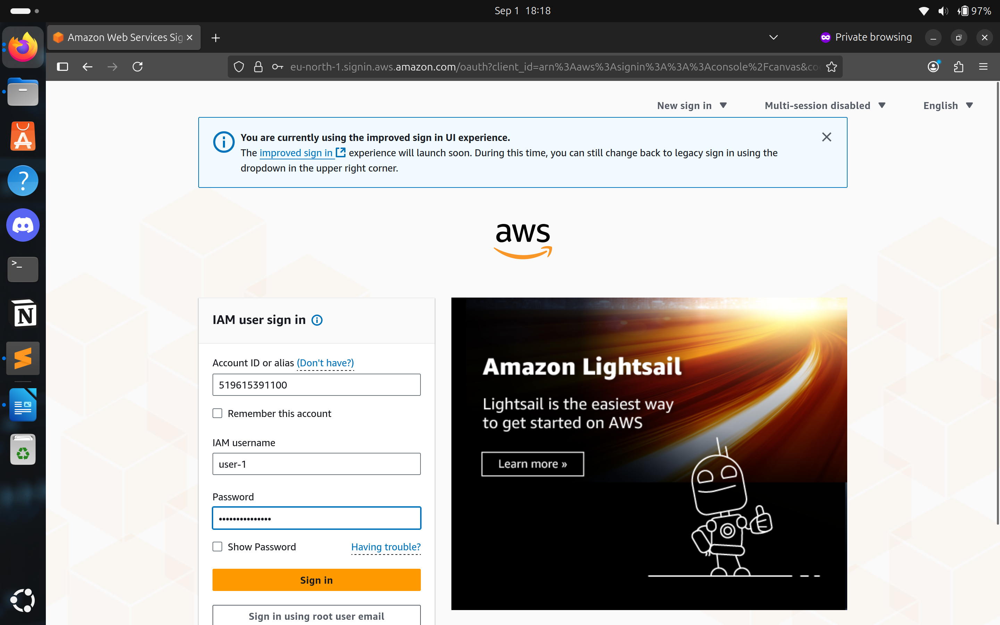
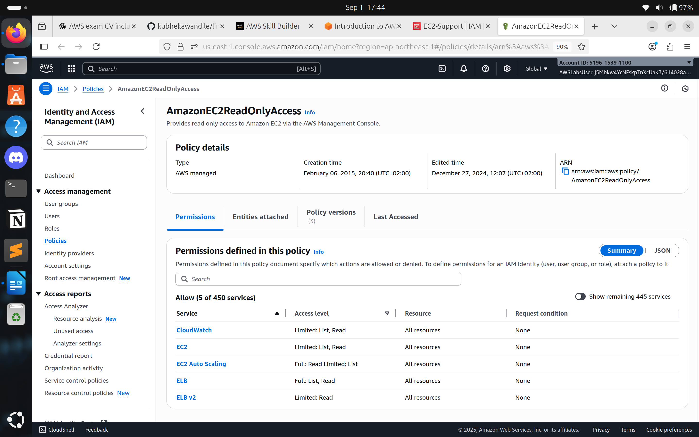
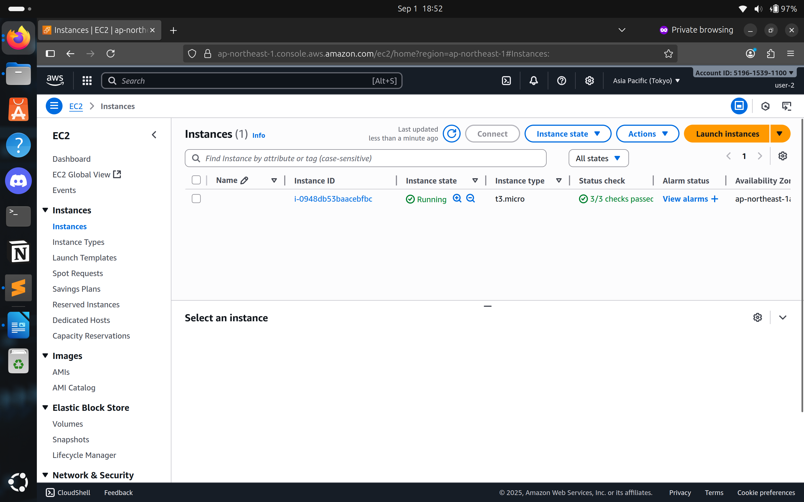
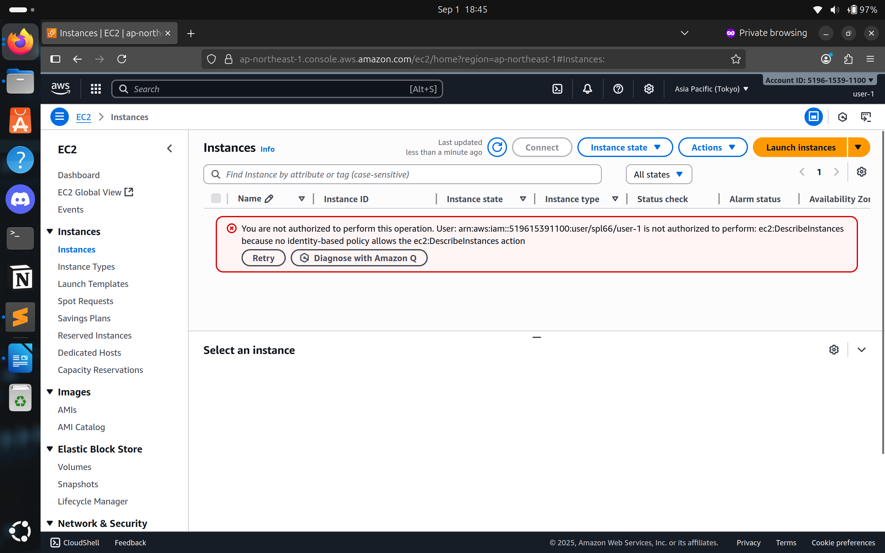
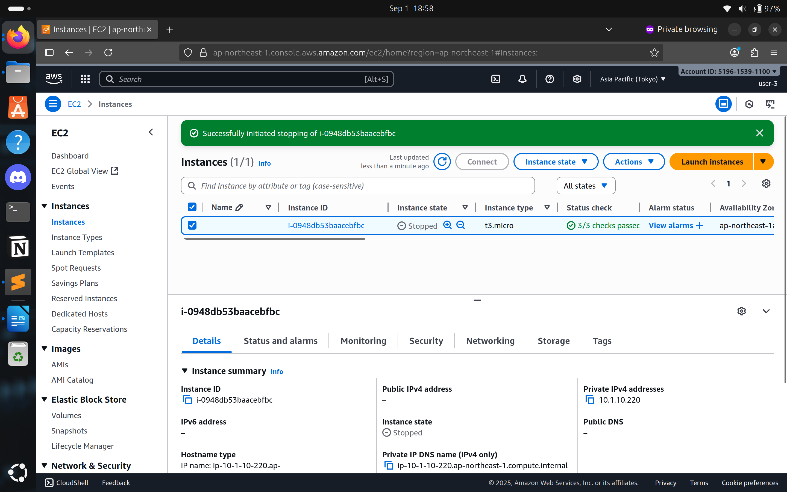
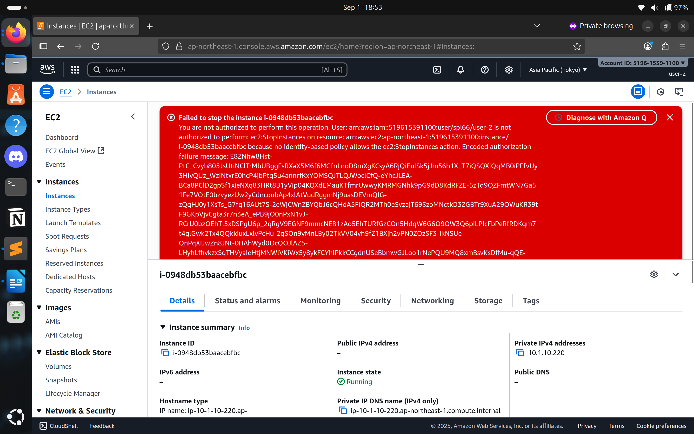

# AWS IAM Lab – Notes & Control Mapping  

## 🎯 Objectives  
The purpose of this lab was to gain hands-on experience with **AWS Identity and Access Management (IAM)** by:  

- Exploring pre-created IAM Users and Groups  
- Inspecting IAM policies applied to groups  
- Adding users to groups with specific capabilities enabled (real-world scenario)  
- Locating and using the IAM sign-in URL  
- Experimenting with the effects of policies on service access  

---

## 📝 What I Did in the Lab  

### 1. Adding Users to Groups  
- Added users into groups with specific capabilities enabled.  
- Verified that permissions were automatically inherited from the group.  

📸 Evidence:  

  
  
  

  

---

### 2. Inspecting IAM Policies  
- Reviewed JSON policies applied to pre-created groups.  
- Confirmed which AWS services were allowed/denied.  

📸 Evidence:  

  
  
  

  

---

### 3. Using the IAM Sign-In URL  
- Located and used the IAM sign-in URL to test access.  
- Verified that users could log in with their assigned credentials and only access what was granted.  

📸 Evidence:  

  
  
  

  

---

### 4. Experimenting with Policy Effects  
- Signed in with test user accounts to confirm access aligned with least privilege.  
- Attempted to access services outside the assigned policy scope — access was denied as expected.  

📸 Evidence:  

  
  
  

  

---

## 📚 Lessons Learned  
- Users automatically **inherit permissions** from their assigned groups.  
- **AWS managed policies** are read-only and cannot be modified by customers.  
- **IAM roles** provide temporary, scoped access to AWS resources and improve security posture.  
- **Identity federation** reduces the overhead of managing IAM users by leveraging corporate credentials.  
- IAM policies define permissions across **users, groups, and roles**.  
- Applying the **principle of least privilege** helps reduce the attack surface.  

---

## ⚠️ Risks Identified (Own Initiative)  
- **No MFA enabled** for users (not part of lab design):  
  - Risk → Compromised credentials could allow unauthorized access.  
- **Overly permissive accounts**:  
  - Risk → Privilege escalation possible if credentials are stolen.  
- **Lack of policy review**:  
  - Risk → Misconfigurations could go unnoticed and increase exposure.  

---

## 🛡️ Control Mapping  

| Risk / Weakness                       | Control Objective                                                                 | Standards / Frameworks |
|---------------------------------------|-----------------------------------------------------------------------------------|-------------------------|
| No MFA enabled                        | Enforce strong authentication for access to systems                               | ISO 27001: A.5.15, NIST CSF PR.AC-7, NIST SP 800-53 AC-02(03) |
| Overly permissive accounts            | Limit access to least privilege necessary for roles                               | ISO 27001: A.8.2, A.8.3, NIST CSF PR.AC-4, NIST SP 800-53 AC-03(01), AC-03(07) |
| Lack of policy review                 | Periodic review of IAM policies to detect and fix misconfigurations               | ISO 27001: A.5.18, NIST SP 800-53 AC-02(07), AC-07(04) |
| Inherited group permissions           | Ensure group membership aligns with job function requirements                     | ISO 27001: A.5.3, NIST CSF PR.AC-1, NIST SP 800-53 AC-03(11) |
| Reliance on long-term user credentials| Encourage use of IAM roles and federation to minimize static access keys          | ISO 27001: A.5.16, NIST SP 800-53 AC-03 |

---

## ✅ Conclusion  
This lab demonstrated not only the basics of **IAM user and group management** but also the importance of aligning configurations with **security frameworks and control objectives**.  
By mapping risks to controls, the exercise highlighted how technical IAM configurations directly support compliance and strengthen an organization’s overall **security posture**.
